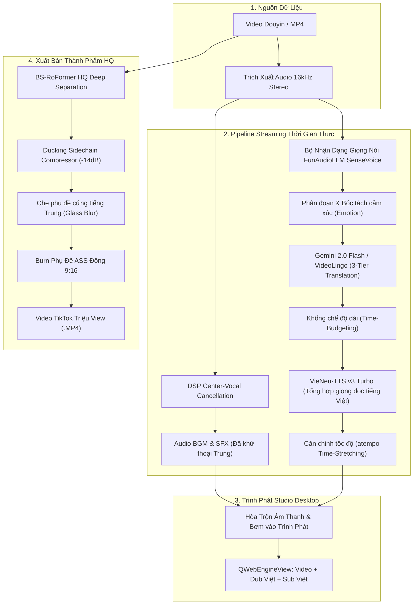

# Douyin2TikTok AI Studio

<div align="center">


[](https://github.com/vanle1101/videotranslate)
[](https://www.python.org/)
[](https://wiki.qt.io/Qt_for_Python)
[](https://pytorch.org/)
[](LICENSE)

**Tiếng Việt** | [English](README_EN.md)

</div>

**Douyin2TikTok AI Studio** là ứng dụng desktop độc lập (Standalone Windows Desktop App) chuyên dịch thuật, khử giọng tiếng Trung, giữ nguyên nhạc nền/tiếng động môi trường (BGM/SFX) và lồng tiếng Việt tự động cho video ngắn (Douyin, TikTok, Kuaishou, Reels, Shorts) theo **thời gian thực (Realtime / Near-Realtime Streaming)**.

Người dùng dán link video hoặc kéo thả file MP4, chỉ cần chờ bộ nhớ đệm (buffer) vài giây là video bắt đầu phát ngay với phụ đề và giọng lồng tiếng Việt, trong khi hệ thống ngầm tiếp tục xử lý các đoạn tiếp theo phía trước.

> 📖 **Tài liệu hướng dẫn:** Xem chi tiết đầy đủ trong thư mục [`docs/`](docs/) — hướng dẫn cài đặt, cấu hình model, tối ưu GPU và xuất bản video triệu view.

---

## ⚡ Tính Năng Nổi Bật

| Gom nhóm & Xử lý Realtime (Streaming Buffer) | Tách Thoại & Giữ Nhạc Nền (BGM Retention) | Giọng Lồng Tiếng Việt AI (VieNeu-TTS) |
|---|---|---|
| **Xem ngay không cần đợi xuất file:** Vừa phát video vừa xử lý cuốn chiếu phía trước. Thanh buffer hiển thị chính xác độ an toàn phát sóng (+45s ahead). | **Triệt tiêu giọng Trung tới -26dB:** Kết hợp DSP Center-Cancellation thời gian thực và BS-RoFormer HQ khi xuất file, giữ trọn 100% tiếng cười, tiếng xe cộ và nhạc nền gốc. | **Giọng đọc tự nhiên, truyền cảm:** Tích hợp VieNeu-TTS v3 Turbo với nhiều chất giọng nam/nữ bản xứ (Trúc Ly, Nam Minh), tự động căn chỉnh thời lượng (Time-Stretching). |

| ASR Tiếng Trung Siêu Tốc (SenseVoice) | Dịch Thuật Phản Chiếu 3 Cấp Độ (Gemini) | Render Chuẩn TikTok 9:16 & Che Sub Gốc |
|---|---|---|
| **Nhận diện giọng nói FunAudioLLM:** Phân tích ASR trong 0.2s–0.4s/câu, phát hiện cảm xúc (Neutral, Happy, Angry) và chia câu chính xác theo dấu chấm ngắt thoại. | **VideoLingo Time-Budgeting:** 3 cấp độ dịch (*Literal ➔ Natural ➔ Final Duration Budget*), ép số lượng từ khớp từng tích tắc khuôn miệng mà không bị nói dồn dập. | **Định dạng tối ưu hóa cho màn hình dọc:** Tạo hiệu ứng kính mờ (Frosted Glass Blur) che phụ đề cứng tiếng Trung và gắn phụ đề ASS viền tương phản sắc nét. |

---

## 📸 Giao Diện Desktop Studio

### 1. Trình Phát Realtime Streaming & Telemetry Đo Lường Vi Sai
Giao diện phòng thu hiện đại với trình phát video tích hợp phụ đề song ngữ, hiển thị trực quan waveform và dải thông số kỹ thuật thời gian thực (*Playable Until, Buffer Ahead, Realtime Factor RTF, Chinese Vocal Suppression Level*).


---

### 2. Quản Lý Mô Hình AI (Model Manager)
Kiểm tra tình trạng sẵn sàng của các engine AI cao cấp chạy hoàn toàn offline trên GPU cá nhân (SenseVoice, VieNeu-TTS, ZeroTTS, EraX F5-TTS, BS-RoFormer, ProPainter).


---

### 3. Cài Đặt Hệ Thống & Cấu Hình Engine
Tùy biến linh hoạt nhà cung cấp dịch thuật LLM (Google Gemini 2.0 Flash, DeepSeek-V3, OpenAI), điều chỉnh mức độ dìm nhạc nền (Audio Ducking Attack/Release) và chọn giọng lồng tiếng theo sở thích.


---

## 🔄 Kiến Trúc Pipeline

Hệ thống hoạt động theo mô hình xử lý phân tầng cuốn chiếu (Rolling Pipeline) với ưu tiên thông minh theo vị trí con trỏ phát (Smart Seek Prioritization):



---

## 📊 Bảng So Sánh Các Engine Công Nghệ

| Thành phần | Engine Mặc định (Premium) | Engine Dự phòng (Fallback) | Ưu điểm & Đột phá kỹ thuật |
|---|---|---|---|
| **Chinese ASR** | **FunAudioLLM SenseVoice** | Faster-Whisper Small | Tốc độ giải mã siêu tốc (<0.3s/câu), trích xuất cảm xúc người nói, không lỗi tràn bộ nhớ VRAM. |
| **Dịch thuật** | **Google Gemini 2.0 Flash + VideoLingo** | DeepSeek-V3 / MyMemory | Prompt phản chiếu 3 tầng, dịch thoát ý theo phong cách TikTok, khống chế số lượng từ khớp slot nói. |
| **Lồng tiếng** | **VieNeu-TTS v3 Turbo** | Edge-TTS Neural | Giọng đọc truyền cảm, chuẩn ngữ điệu bản xứ Việt Nam, hỗ trợ clone giọng từ mẫu audio 3 giây. |
| **Tách thoại** | **DSP Realtime + BS-RoFormer HQ** | Mute toàn phần | Khử sạch thoại Trung đến -26dB, bảo toàn 100% tiếng bước chân, tiếng cười, âm thanh môi trường và BGM. |
| **Giao diện** | **PySide6 Native Desktop Shell** | Trình duyệt Web Localhost | 100% giao diện phần mềm Windows chuyên nghiệp, kéo thả video, khay hệ thống (System Tray), zero terminal. |

---

## 🚀 Hướng Dẫn Cài Đặt & Sử Dụng

### Yêu Cầu Hệ Thống
- **Hệ điều hành:** Windows 10 / 11 (64-bit).
- **GPU:** NVIDIA GeForce GTX 1050 Ti trở lên (VRAM >= 4GB) hoặc CPU đa nhân.
- **Phần mềm phụ trợ:** FFmpeg đã có trong hệ thống hoặc thư mục PATH.

### 1. Khởi Chạy 1-Click (Khuyến Nghị)
Không cần mở dòng lệnh PowerShell hay mở trình duyệt web. Chỉ cần nhấp đúp chuột vào file:

👉 **`Start Douyin2TikTok AI Studio.bat`** (hoặc **`start.bat`**)

Ứng dụng sẽ tự động:
1. Cấp phát cổng mạng an toàn chống trùng lặp.
2. Nạp trước các model AI (SenseVoice, VieNeu-TTS) với màn hình Splash Screen giao diện tối.
3. Mở trực tiếp cửa sổ làm việc **Douyin2TikTok AI Studio** trên màn hình máy tính.

### 2. Sử Dụng Nhanh
1. **Nạp video:** Kéo thả video MP4 từ Windows Explorer vào cửa sổ Studio hoặc nhấn **"Chọn Video MP4"**.
2. **Chọn giọng lồng tiếng:** Chọn giọng đọc yêu thích (*Trúc Ly, Nam Minh, Mai Phương*).
3. **Bấm "Dịch & Phát Realtime":** Sau 3-5 giây đệm ban đầu, video sẽ phát kèm phụ đề và giọng đọc tiếng Việt.
4. **Tua thông minh (Smart Seek):** Click vào bất kỳ mốc thời gian nào trên thanh tiến trình, hệ thống tự động ưu tiên dịch ngay đoạn bạn muốn xem.
5. **Xuất bản TikTok 9:16:** Nhấn **"Xuất Bản Video (HQ)"** để render video với chất lượng âm thanh BS-RoFormer cao cấp nhất.

---

## 🔑 Cấu Hình API Keys

Ứng dụng có thể chạy hoàn toàn tự động bằng công cụ dịch miễn phí tích hợp sẵn. Để kích hoạt bộ não dịch thuật AI phản chiếu cao cấp của **Gemini 2.0 Flash**, bạn chỉ cần thêm key trong tab **Cài Đặt** trên giao diện ứng dụng hoặc tạo file `.env`:

```env
# Google Gemini API Key (Đăng ký miễn phí tại https://aistudio.google.com/)
GEMINI_API_KEY=AIzaSy...

# Hoặc DeepSeek API Key (Tùy chọn)
DEEPSEEK_API_KEY=sk-...
```

---

## ⌨️ Phím Tắt Tiện Ích

- `Space`: Tạm dừng / Tiếp tục phát video.
- `J` / `L`: Lùi lại 5 giây / Tiến lên 5 giây.
- `K`: Tạm dừng pipeline xử lý nền.
- `S`: Lưu nhanh phụ đề hiện tại.
- `Esc`: Thoát chế độ toàn màn hình.

---

## 📁 Cấu Trúc Thư Mục

```
e:/Dịch video/
├── Start Douyin2TikTok AI Studio.bat   # Launcher Desktop chính thức (Zero terminal)
├── start.bat                           # Launcher tương thích chuyển hướng
├── desktop_app.py                      # Vỏ ứng dụng PySide6 Desktop & System Tray
├── config.py                           # Cấu hình hệ thống & luồng bảo vệ SafeStream
├── main.py                             # FastAPI Streaming Server & WebSocket Bus
├── core/
│   ├── streaming/                      # Pipeline streaming thời gian thực, audio ducking & exporter
│   ├── engines/
│   │   ├── asr/                        # FunAudioLLM SenseVoice & Faster-Whisper
│   │   ├── translation/                # VideoLingo Semantic Translator (Gemini/DeepSeek)
│   │   ├── tts/                        # VieNeu-TTS v3 Turbo & Edge-TTS
│   │   └── separator/                  # Realtime Center Suppressor & BS-RoFormer HQ
│   └── services/                       # Trình quản lý tiến trình ServiceManager & Dynamic Port
├── templates/                          # Giao diện HTML5 Studio
├── static/                             # JavaScript WebSocket, CSS Styling
├── docs/                               # Tài liệu hướng dẫn & hình ảnh minh họa
│   └── images/                         # Ảnh chụp màn hình giao diện & Banner chính thức
├── tests/                              # Bộ kiểm thử tự động (E2E, Port, Diagnostics)
└── workspace/                          # Khu vực lưu trữ video đầu vào và thành phẩm
```

---

## 📄 Giấy Phép (License)

Dự án được phân phối dưới giấy phép **MIT License**. Bạn được toàn quyền sử dụng, chỉnh sửa và ứng dụng cho mục đích cá nhân hoặc thương mại.
