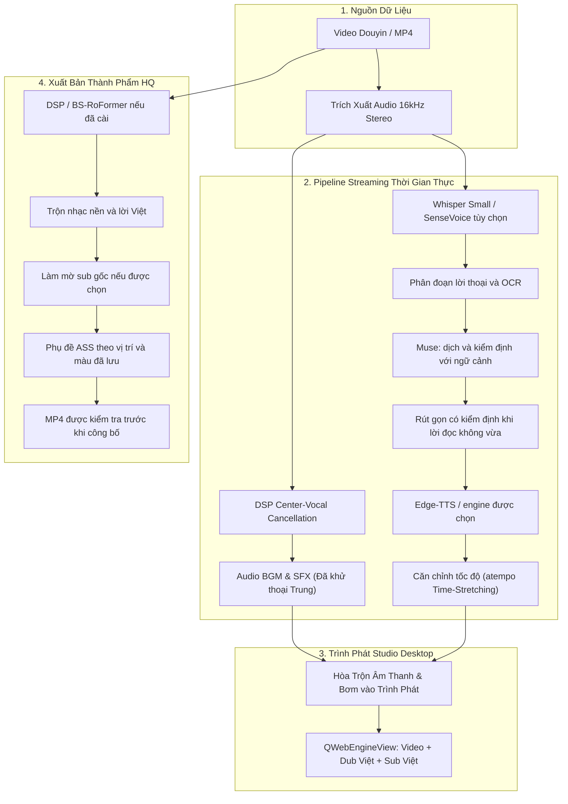

# Douyin2TikTok AI Studio

> **Bản cấu hình Windows / RAM 16 GB:** xem [hướng dẫn cài đặt và vận hành](docs/windows-guide.md). Chạy `setup.bat` cho máy mới, `start.bat` để mở. Cấu hình mặc định hiện tại: Whisper Small CPU int8, Edge-TTS và DSP; các engine cao cấp trong phần giới thiệu bên dưới là tùy chọn cần cài riêng.

> **Dịch bằng OpenCode Muse:** mặc định **OpenCode Zen · Muse Spark Free** (`muse-spark-1.3-contributor-free`), dùng phiên OpenCode đã kết nối trên máy. OpenRouter Free, Gemini, DeepSeek và Google/MyMemory là các lựa chọn thay thế; ứng dụng không tự đổi sang model trả phí khi provider lỗi. Kiểm tra kết nối ở Cài đặt; key không gửi ra giao diện hay đẩy GitHub.

> **Gemini và Muse:** Gemini đứng đầu Cài đặt, có kiểm tra model đã lưu và xử lý lỗi API rõ ràng. Muse dùng được phiên đăng nhập Chrome đang mở sau khi bạn cho phép Chrome kết nối, hoặc dùng hồ sơ Chrome riêng. Chạy `setup_muse.bat` một lần rồi kết nối trong Cài đặt. Tích hợp không tự cấp token; xem [hướng dẫn Muse](docs/windows-guide.md#muse-qua-tài-khoản-của-bạn-thử-nghiệm).

<div align="center">


[](https://github.com/vanle1101/videotranslate)
[](https://www.python.org/)
[](https://wiki.qt.io/Qt_for_Python)
[](https://pytorch.org/)
[](LICENSE)

**Tiếng Việt** | [English](README.en.md)

</div>

**Douyin2TikTok AI Studio** là ứng dụng Windows dịch video Trung sang Việt, tạo giọng đọc và phụ đề. Cấu hình trên máy này dùng Whisper Small, OpenCode Muse, Edge-TTS và DSP để giảm giọng gốc. Chất lượng nhận diện, dịch và tách thoại phụ thuộc video và nhà cung cấp.

Dán nội dung chia sẻ có link hoặc chọn file MP4 để xử lý một đoạn xem trước. Bấm **Dịch toàn bộ** để tiếp tục từng đoạn; có thể sửa phần đã xử lý trong khi chờ. Thời gian chờ phụ thuộc nhận diện và các lượt Muse kiểm định, không có cam kết hoàn tất trong vài giây. Các câu lỗi hoặc chưa đủ bằng chứng vẫn được hiển thị để thử lại; chỉ xuất bản đầy đủ khi dữ liệu cần thiết đã hợp lệ. Xem [báo cáo kiểm thử runtime hiện tại](docs/RUNTIME_QA_REPORT.md) để biết các luồng đã kiểm tra và lỗi còn lại.

Tài liệu: [Cài đặt và vận hành](docs/windows-guide.md) · [Chức năng giao diện](docs/ui-reference.md) · [Báo cáo kiểm thử](docs/reports/).

**Transcript cạnh video:** bấm chữ trong bản dịch để sửa tại vị trí đó; bấm mốc thời gian hoặc câu gốc để tua theo câu. **Ctrl+Enter** lưu và tạo lại giọng đọc, giữ nguyên thời gian câu. Cần lưu hoặc hủy bản nháp trước khi xuất. Xem [hướng dẫn sửa transcript](docs/windows-guide.md#sửa-transcript-cạnh-video).

---

## ⚡ Tính Năng Nổi Bật

| Xử lý và xem trước từng đoạn | Giảm giọng gốc và trộn nhạc nền | Giọng đọc tiếng Việt |
|---|---|---|
| Phát phần đã có giọng đọc và phụ đề; lưu tiến độ để tiếp tục khi tác vụ lỗi. | DSP giảm giọng gốc; BS-RoFormer là tùy chọn cần cài riêng. Không bảo đảm giữ nguyên mọi âm thanh hoặc loại sạch giọng gốc. | Edge-TTS là mặc định; các engine local là tùy chọn. Đo WAV thật, căn nhịp tối đa 1,15× và từ chối cắt lời để ép vừa câu. |

| Nhận diện lời tiếng Trung | Dịch và kiểm định bằng Muse | Xuất MP4 và tùy chỉnh phụ đề |
|---|---|---|
| Whisper Small nhận diện trên CPU; SenseVoice cần model riêng. Mốc ASR được giữ để đối chiếu nguồn. | Muse dịch và kiểm định riêng với ngữ cảnh trước–sau. Bản rút gọn phải qua kiểm tra nghĩa và văn nói rồi mới tạo giọng. | Giữ kích thước video gốc, tùy chỉnh màu/vị trí phụ đề và bật hoặc tắt làm mờ vùng sub gốc đã nhận diện. |

---

## 📸 Giao Diện Desktop Studio

### 1. Trình Phát Realtime Streaming & Telemetry Đo Lường Vi Sai
Giao diện phòng thu hiện đại với trình phát video tích hợp phụ đề song ngữ, hiển thị trực quan waveform và dải thông số kỹ thuật thời gian thực (*Playable Until, Buffer Ahead, Realtime Factor RTF, Chinese Vocal Suppression Level*).


---

### 2. Quản Lý Mô Hình AI (Model Manager)
Kiểm tra tình trạng sẵn sàng của các engine AI cao cấp chạy hoàn toàn offline trên GPU cá nhân (SenseVoice, VieNeu-TTS, ZeroTTS, EraX F5-TTS, BS-RoFormer, ProPainter).


---

### 3. Cài Đặt Hệ Thống & Cấu Hình Engine
Tùy biến linh hoạt nhà cung cấp dịch thuật LLM (Google Gemini 2.0 Flash, DeepSeek-V3, OpenAI), điều chỉnh mức độ dìm nhạc nền (Audio Ducking Attack/Release) và chọn giọng lồng tiếng theo sở thích.


---

## 🔄 Kiến Trúc Pipeline

Hệ thống hoạt động theo mô hình xử lý phân tầng cuốn chiếu (Rolling Pipeline) với ưu tiên thông minh theo vị trí con trỏ phát (Smart Seek Prioritization):



---

## 📊 Bảng So Sánh Các Engine Công Nghệ

| Thành phần | Mặc định | Tùy chọn | Hành vi |
|---|---|---|---|
| **Chinese ASR** | Faster-Whisper Small CPU int8 | SenseVoice khi có model | Nhận diện từng khoảng nguồn, giữ mốc câu để tiếp tục và đối chiếu. |
| **Dịch thuật** | OpenCode Muse | Các provider trong Cài đặt | Dịch và kiểm định độc lập; lỗi provider được hiển thị, không tự đổi sang model trả phí. |
| **Lồng tiếng** | Edge-TTS Neural | Piper, VieNeu và engine đã cài | Chỉ cho chọn giọng sẵn sàng, đo thời lượng thực sau tổng hợp. |
| **Tách thoại** | DSP | BS-RoFormer khi đã cài | Giảm giọng gốc và trộn lời Việt; mức tách phụ thuộc nội dung. |
| **Giao diện** | PySide6 và Qt WebEngine | Trang localhost | Transcript, lịch sử dự án, kéo thả và khay hệ thống. |

---

## 🚀 Hướng Dẫn Cài Đặt & Sử Dụng

### Yêu Cầu Hệ Thống
- **Hệ điều hành:** Windows 10 / 11 (64-bit).
- **GPU:** NVIDIA GeForce GTX 1050 Ti trở lên (VRAM >= 4GB) hoặc CPU đa nhân.
- **Phần mềm phụ trợ:** FFmpeg đã có trong hệ thống hoặc thư mục PATH.

### 1. Khởi Chạy 1-Click (Khuyến Nghị)
Không cần mở dòng lệnh PowerShell hay mở trình duyệt web. Chỉ cần nhấp đúp chuột vào file:

👉 **`Start Douyin2TikTok AI Studio.bat`** (hoặc **`start.bat`**)

Ứng dụng sẽ tự động:
1. Cấp phát cổng mạng an toàn chống trùng lặp.
2. Nạp trước các model AI (SenseVoice, VieNeu-TTS) với màn hình Splash Screen giao diện tối.
3. Mở trực tiếp cửa sổ làm việc **Douyin2TikTok AI Studio** trên màn hình máy tính.

### 2. Sử Dụng Nhanh
1. **Nạp video:** Kéo thả video MP4 từ Windows Explorer vào cửa sổ Studio hoặc nhấn **"Chọn Video MP4"**.
2. **Chọn giọng lồng tiếng:** Chọn giọng đọc yêu thích (*Trúc Ly, Nam Minh, Mai Phương*).
3. **Bấm Bắt đầu:** Chờ nhận diện, dịch và kiểm định đoạn xem trước. Các bước chờ AI có thể mất vài phút.
4. **Tua thông minh (Smart Seek):** Click vào bất kỳ mốc thời gian nào trên thanh tiến trình, hệ thống tự động ưu tiên dịch ngay đoạn bạn muốn xem.
5. **Xuất bản TikTok 9:16:** Nhấn **"Xuất Bản Video (HQ)"** để render video với chất lượng âm thanh BS-RoFormer cao cấp nhất.

---

## 🔑 Cấu Hình API Keys

Ứng dụng có thể chạy hoàn toàn tự động bằng công cụ dịch miễn phí tích hợp sẵn. Để kích hoạt bộ não dịch thuật AI phản chiếu cao cấp của **Gemini 2.0 Flash**, bạn chỉ cần thêm key trong tab **Cài Đặt** trên giao diện ứng dụng hoặc tạo file `.env`:

```env
# Google Gemini API Key (Đăng ký miễn phí tại https://aistudio.google.com/)
GEMINI_API_KEY=AIzaSy...

# Hoặc DeepSeek API Key (Tùy chọn)
DEEPSEEK_API_KEY=sk-...
```

---

## ⌨️ Phím Tắt Tiện Ích

- `Space`: Tạm dừng / Tiếp tục phát video.
- `J` / `L`: Lùi lại 5 giây / Tiến lên 5 giây.
- `K`: Tạm dừng pipeline xử lý nền.
- `S`: Lưu nhanh phụ đề hiện tại.
- `Esc`: Thoát chế độ toàn màn hình.

---

## 📁 Cấu Trúc Thư Mục

```
Dịch Video/
├── Start Douyin2TikTok AI Studio.bat   # Launcher Desktop chính thức (Zero terminal)
├── start.bat                           # Launcher tương thích chuyển hướng
├── desktop_app.py                      # Vỏ ứng dụng PySide6 Desktop & System Tray
├── config.py                           # Cấu hình hệ thống & luồng bảo vệ SafeStream
├── main.py                             # FastAPI Streaming Server & WebSocket Bus
├── scripts/                            # Cài đặt, tạo shortcut, kiểm tra và tải model
├── core/
│   ├── streaming/                      # Pipeline streaming thời gian thực, audio ducking & exporter
│   ├── engines/
│   │   ├── asr/                        # FunAudioLLM SenseVoice & Faster-Whisper
│   │   ├── translation/                # VideoLingo Semantic Translator (Gemini/DeepSeek)
│   │   ├── tts/                        # VieNeu-TTS v3 Turbo & Edge-TTS
│   │   └── separator/                  # Realtime Center Suppressor & BS-RoFormer HQ
│   └── services/                       # Trình quản lý tiến trình ServiceManager & Dynamic Port
├── templates/                          # Giao diện HTML5 Studio
├── static/                             # JavaScript WebSocket, CSS Styling
├── docs/                               # Tài liệu hướng dẫn & hình ảnh minh họa
│   └── images/                         # Ảnh chụp màn hình giao diện & Banner chính thức
├── tests/                              # Bộ kiểm thử tự động (E2E, Port, Diagnostics)
└── workspace/                          # Dữ liệu cục bộ, không đưa lên Git
    ├── inputs/                        # Video nguồn
    ├── outputs/                       # Thành phẩm, phụ đề và báo cáo kiểm tra
    ├── models/                        # Model đã tải
    ├── tools/                         # Công cụ chạy tại máy
    ├── cache/                         # Dữ liệu phiên xử lý
    ├── logs/                          # Nhật ký chẩn đoán
    └── temp/                          # File thử, trung gian và thư mục chờ xóa
```

---

## 📄 Giấy Phép (License)

Dự án được phân phối dưới giấy phép **MIT License**. Bạn được toàn quyền sử dụng, chỉnh sửa và ứng dụng cho mục đích cá nhân hoặc thương mại.
