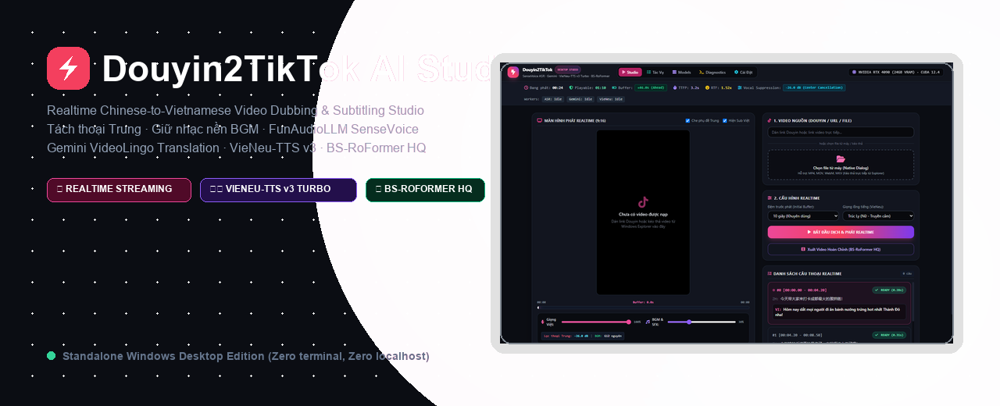
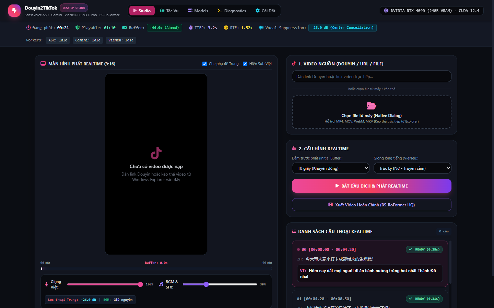
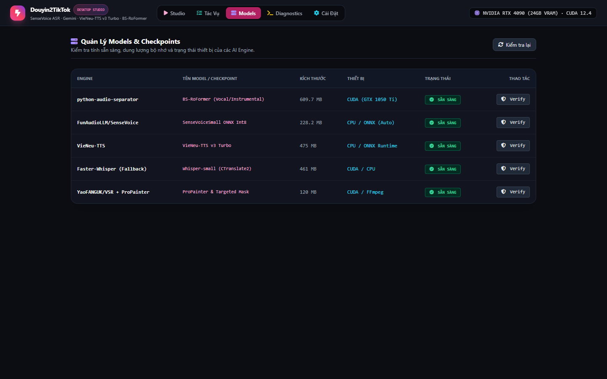
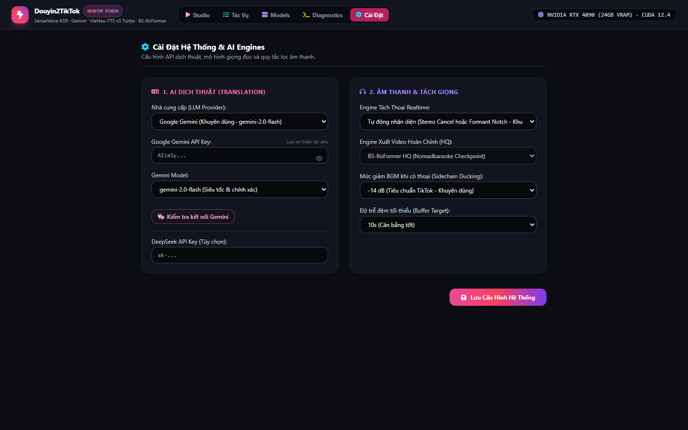

# Douyin2TikTok AI Studio

[Tiếng Việt](README.md) | **English**

**Douyin2TikTok AI Studio** is a standalone Windows desktop application designed for **real-time / near-realtime** Chinese-to-Vietnamese video translation, Chinese vocal suppression, background music/SFX retention, emotional Vietnamese dubbing, and 9:16 vertical video rendering for TikTok, Reels, and Shorts.

Simply paste a video URL or drag-and-drop an MP4 file. After buffering for just a few seconds, playback begins immediately with synchronized Vietnamese subtitles and voiceover, while the backend continuously processes upcoming segments ahead of playback.

---

## ⚡ Key Highlights

| Realtime Streaming Buffer | Chinese Vocal Removal & BGM Retention | Vietnamese AI Dubbing (VieNeu-TTS) |
|---|---|---|
| **Zero waiting for full renders:** Watch and listen while upcoming segments process ahead (+45s buffer). | **Up to -26dB suppression:** Realtime DSP center-cancellation + BS-RoFormer HQ export, preserving 100% of BGM & SFX. | **Natural human prosody:** 8B-parameter VieNeu-TTS v3 Turbo with automated atempo time-stretching. |

| Ultra-fast Chinese ASR (SenseVoice) | 3-Tier Semantic Translation (Gemini) | 9:16 Vertical Video & Hardcoded Sub Masking |
|---|---|---|
| **FunAudioLLM SenseVoice:** High-accuracy ASR in <0.3s with speaker emotion classification. | **VideoLingo Duration Budgeting:** 3-tier translation (*Literal ➔ Natural ➔ Time-Budget*) tailored for TikTok pacing. | **Frosted glass blur:** Elegantly masks Chinese burned subtitles and overlays stylized high-contrast ASS captions. |

---

## 📸 Desktop Studio Screenshots

### 1. Realtime Streaming Player & Telemetry Ribbon

### 2. AI Model Management Panel

### 3. Engine Settings & Audio Ducking Configuration

---

## 🚀 Quick Start (1-Click)

Double click the Windows launcher:
👉 **`Start Douyin2TikTok AI Studio.bat`**

No command lines, no black terminal windows, no localhost in a browser. Launches directly as a native Windows desktop program with system tray controls and drag-and-drop support.

---

## 📄 License
Distributed under the **MIT License**. Free for personal and commercial applications.
